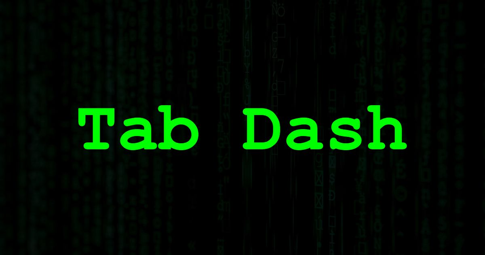

# Tab-dash.live 🎉

**Welcome to Tab Dash!** The tab that does *literally* nothing until you stare at it long enough. Even then, it still does quite literally and virtually `nothing`. Mostly. Built for devs, sysadmins, and anyone who needs their browser tabs to serve serious looks and pointless information.

## Features

- **💻 "What’s My IP?"** – Sometimes, we just need our public IP real quick nah wut i mean?
- **✨ Random Quotes** – Enlightening (?) dev quotes pop up for those who think they needed inspiration but maybe didn’t.
- **🎬 Backgrounds** – Choose from glitchy videos that make you look way more legit than you are.
- **🎶 Sounds** - Mouse, keyboard and epic sounds to make it sound like you're actually working.

## Deploy to Netlify

If you wanted to deploy to Netlify, this button below will clone this repo exactly as you see it, and deploy the app in your Netlify environment.

## Deploy somewhere else

All you need is something that can serve static web files. S3, Netlify, your dusty Power Edge T320.

Go to the [releases](https://github.com/travisnwade/tab-dash-live/releases) page and download that fat zip.
Unzip that ish to your web root.
Map your domain to this web hosting box you got.
Give it a SSL cert, Let's Encrypt or whatever.

## How to use

Once it's deployed, literally just:

1. Open your instance of tab dash in a browser.
2. Embrace it's infinite uselessness.
3. ???
4. Profit? (No guarantees.)

## License

Free as a bird (MIT License).

## Tech used

1. [IPify](ipify.org) - for getting public IP and stuff.
2. [Font Awesome](https://fontawesome.com/) - For cool icons dude.

## Contributing

Eh. Not really much but let me know if you have an idea.

## Contact

Still reading this? Hit me up on Github if you want. Enjoy you filthy creature.
